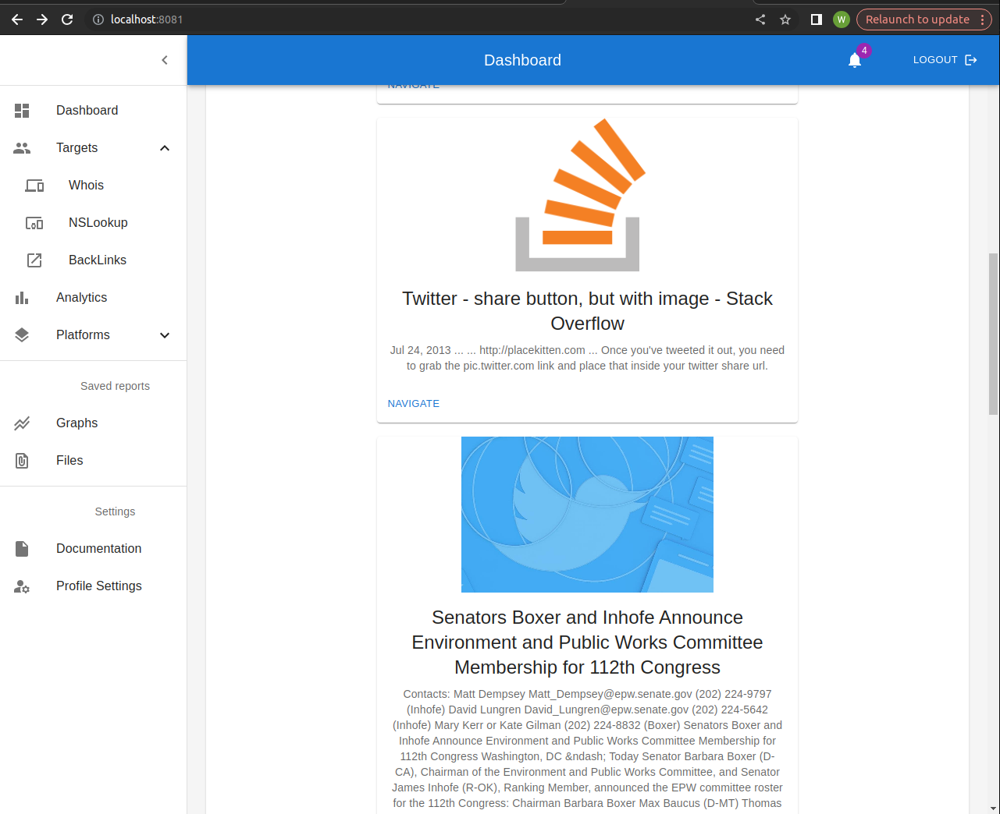
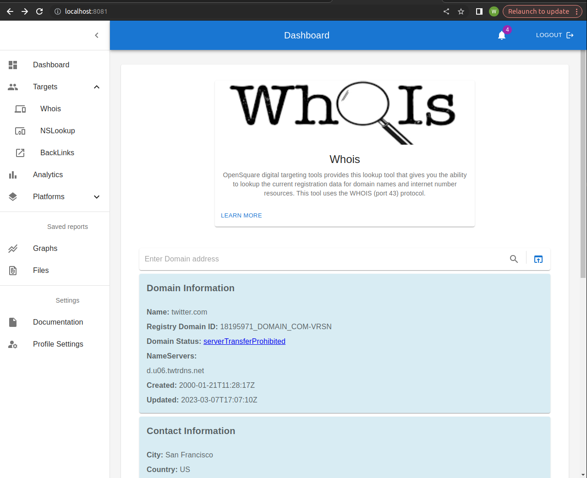
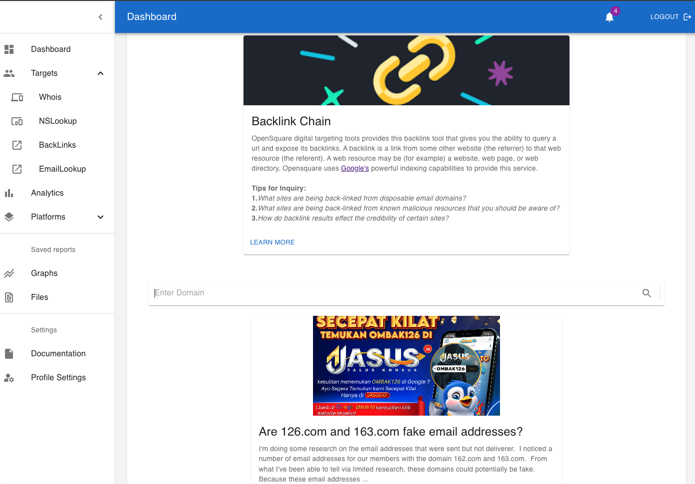
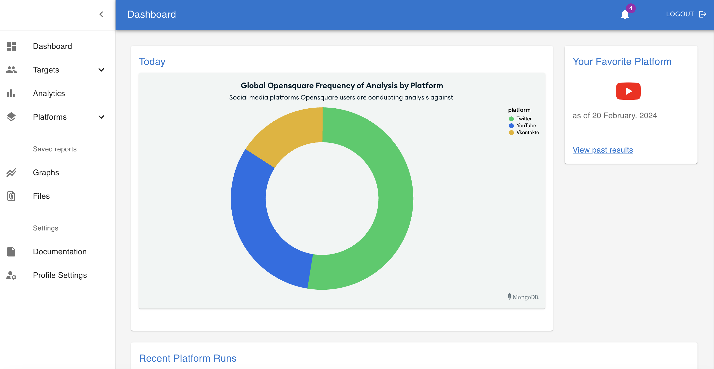
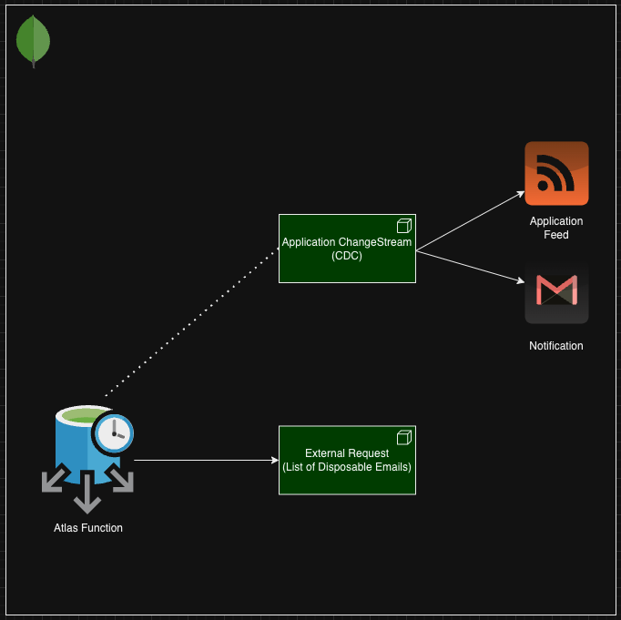

<a name="readme-top"></a>


<!-- PROJECT SHIELDS -->
<!--
*** I'm using markdown "reference style" links for readability.
*** Reference links are enclosed in brackets [ ] instead of parentheses ( ).
*** See the bottom of this document for the declaration of the reference variables
*** for contributors-url, forks-url, etc. This is an optional, concise syntax you may use.
*** https://www.markdownguide.org/basic-syntax/#reference-style-links
-->

[![MIT License][license-shield]][license-url]
[![LinkedIn][linkedin-shield]][linkedin-url]


<!-- PROJECT LOGO -->
<br />
<div align="center">
  <a href="https://bitbucket.org/intelligence-opensent/opensentop/src/master/">
    
  </a>

<h3 align="center">Opensquare</h3>

  <p align="center">
    Opensource social media intelligence and OSINT
    <br />
    <a href="https://github.com/walimorris/opensquare"><strong>Explore the docs »</strong></a>
    <br />
    <br />
    <a href="https://github.com/walimorris/opensquare">View Demo</a>
    ·
    <a href="https://github.com/walimorris/opensquare">Report Bug</a>
    ·
    <a href="https://github.com/walimorris/opensquare">Request Feature</a>
  </p>
</div>


<!-- TABLE OF CONTENTS -->
<details>
  <summary>Table of Contents</summary>
  <ol>
    <li>
      <a href="#about-the-project">About The Project</a>
      <ul>
        <li><a href="#built-with">Built With</a></li>
      </ul>
    </li>
    <li>
      <a href="#getting-started">Getting Started</a>
      <ul>
        <li><a href="#prerequisites">Prerequisites</a></li>
        <li><a href="#installation">Installation</a></li>
      </ul>
    </li>
    <li><a href="#usage">Usage</a></li>
    <li><a href="#roadmap">Roadmap</a></li>
    <li><a href="#contributing">Contributing</a></li>
    <li><a href="#contact">Contact</a></li>
    <li><a href="#acknowledgments">Acknowledgments</a></li>
  </ol>
</details>


<!-- ABOUT THE PROJECT -->
## About The Project
There were 150 million new social media users between April 2022 and April 2023 - that's a 3.2% increase year-over-year from the current 
4.8 billion social media users worldwide, representing 59.9% of the global population and 92.7% of all internet users. Businesses use 
social media to gain insights about various topics: user sentiment around products, strong products and weak products, events, all things that cater to 
their customer. For intelligence analysts and social science researchers, who are their customers? Policymakers, the everyday citizen, everyone in society. 
This project's user, its customer, is the intelligence and social sciences analysts and researchers. As technology continues up the curve of
innovation, and society continues to increasingly use social media as the public square, researchers can use this available data for good, to 
draw insights, to slow down or stop harmful incidents, to help society, to develop plans based on public consensus, better inform policymakers of 
what their constituents need and want (and better plan solutions that increase the satisfaction of their customer). As it becomes harder for governments
to understand and execute solutions that better serve their constituents, the idea of adaptive governance, a focus on decentralized decision-making
structures, becomes unavoidable. Not only can insights gained from social media assist policymakers, it can assist adaptive governance entities and groups
to better serve their populations. This product is for the intelligence analyst, the social scientist, the data scientist and those interested in improving 
the quality of our human existence through deep public analysis and data-driven solutions.


<p align="right">(<a href="#readme-top">back to top</a>)</p>


### Built With

* [![Springboot][Springboot.com]][Springboot-url]
* [![MongoDB][MongoDB.com]][MongoDB-url]
* [![React][React.js]][React-url]
* [![AWS][AWS.com]][AWS-url]

<p align="right">(<a href="#readme-top">back to top</a>)</p>


## Features

## Watch Retrieval Augmented Generation (RAG) Demo
[](https://vimeo.com/949702850)


Along with other features, OpenSquare provides [Digit Footprint](https://en.wikipedia.org/wiki/Digital_footprint) targeting 
tools, some using well-known OSINT methods such as [Backlinks](https://en.wikipedia.org/wiki/Backlink), [NSLookup](https://en.wikipedia.org/wiki/Nslookup), 
and [Whois](https://en.wikipedia.org/wiki/WHOIS). Having a general suite of tools in a single place can increase user productivity. Easily navigate between
dashboard workspaces and use output from one tool as input for another.

<div align="center">
  <a href="https://github.com/walimorris/opensquare">
    
  </a>
</div>
<div align="center">
  <a href="https://github.com/walimorris/opensquare">
    
  </a>
</div>
<div align="center">
  <a href="https://github.com/walimorris/opensquare">
    
  </a>
</div>

### MongoDB Charts Highlight
Gain valuable insights about Opensquare users and popular platforms being used in various OSINT strategies with [MongoDB Charts](https://www.mongodb.com/products/charts)

<div align="center">
  <a href="https://github.com/walimorris/opensquare">
    
  </a>
</div>

### MongoDB Atlas Functions Highlight
An [Atlas Function](https://www.mongodb.com/docs/atlas/app-services/functions/) is a piece of server-side JavaScript code that you can write to define your app's behavior. 
Atlas Functions can call other functions, call external APIs, create triggers, and run on a schedule amongst other things.
Atlas Functions exhibit the power of serverless, and doesn't require any management on our end. Instead, we just write our function's code
and the managed server within Atlas cluster handles the execution environment. Atlas Functions allow us at Opensquare
to implement exciting features. Below is a diagram example of how we implemented real time feeds/notifications for updating users about
malicious email addresses and a target's real-time location. Keep in mind that this is extensible and can be applied to a number of use-cases: 
device monitoring/alerting, location-tracking, real time analytics, etc. 

In our example below, we use a Scheduled Atlas Function to periodically send a get request to an external service that contains a list of disposable email 
addresses that's maintained by a group of active participants. New disposable email addresses are inserted within a MongoDB collection 
that stores disposable email addresses. The work of the serverless function is done. Now, within the context of our Springboot application and another 
feature that makes MongoDB Atlas truly versatile is its Change Data Capture ([CDC](https://en.wikipedia.org/wiki/Change_data_capture)) feature [Change Streams](https://www.mongodb.com/docs/manual/changeStreams/). Within our application 
we implement a ChangeStream Watch cursor on various collections that monitor and have access to real-time data changes. This means that 
once new disposable email addresses are inserted into collection we can send notifications through email/sms or update users directly in app via an application feed.
Worry not, this feature will be useful in many different OSINT strategies and against various use-cases where real time updates can be more meaningful. 

These features of MongoDB Atlas: CDC, streaming and serverless functions significantly reduces application complexity now that we don't need to implement complex code to tail the oplog,
and will allow Opensquare to provide massive productivity boosts to users. 


<div align="center">
  <a href="https://github.com/walimorris/opensquare">
    
  </a>
</div>

### Video Transcription with OpenAI's Whisper
Opensquare utilizes [Whisper](https://github.com/openai/whisper): a general-purpose speech recognition model.  It is trained on a large dataset of diverse audio and is also a
multitasking model that can perform multilingual speech recognition, speech translation, and language identification.

Using Opensquare's available API's, you can query and transcribe YouTube videos. Transcripts will report time and text properties. This API is used to build features on Opensquare , but will also be available to the public as an easy to use API. 

`opensquare/api/youtube/en/transcribe?videoId=l9AzO1FMgM8`

produces: 

`[
{
"time": "0.0",
"text": "Java, a high-level multi-paradigm programming language famous for its ability to compile"
},
{
"time": "5.2",
"text": "to platform independent bytecode."
},
{
"time": "7.44",
"text": "It was designed by James Gosling in 1990 at Sun Microsystems."
},
{
"time": "11.700000000000001",
"text": "One of its first demonstrations was the Star 7 PDA, which gave birth to the Java mascot"
},...
]`


<!-- GETTING STARTED -->
## Getting Started

To get a local copy up and running follow these simple example steps.

### Prerequisites
* Linux
* Java 17
  ```sh
  java --version
  ```

* Maven 3.9 or above
  ```sh
  mvn --version
  ```

### Installation

1. Clone the repo
   ```sh
   git git clone https://opensentop@bitbucket.org/intelligence-opensent/opensentop.git
   ```
2. Install dependencies (including NPM) default profile 
   ```sh
   mvn clean install
   ```
   
3. Run webpack in development mode
   ```sh
   npm run watch
   
4. There are some configuration files you'll need - feel free to ping me for those.

<p align="right">(<a href="#readme-top">back to top</a>)</p>


<!-- USAGE EXAMPLES -->
## Usage

This project uses Eirik Sletteberg's [Frontend-Maven-Plugin](https://github.com/eirslett/frontend-maven-plugin) which allows our team to use a single plugin for both frontend and backend builds in a single repo.
This plugin is capable of various configurations, but the configuration used in this project is minimum only using Webpack and few configurations to install Node and NPM. The meat of this usage is from the 
creation of the project's bundle which is integrated using a `<script>` in root of React application (typical React fashion) exposed in the `index.html` file in the Springboot resources folder.
```
<body>
<div id='root'>
</div>
<script src="built/bundle.js"></script>
</body>
```
Webpack will create a build bundle that contains the source for the React application entry in `app.js` under the `js` package of this project.
```
entry: path.resolve(__dirname, "/src/main/js/app.js"),
    devtool: 'inline-source-map',
    cache: true,
    mode: 'development',
    output: {
        path: __dirname,
        filename: 'src/main/resources/static/built/bundle.js'
    },
```

<p align="right">(<a href="#readme-top">back to top</a>)</p>

### Kafka Usage - Local
If you're running kafka you should review the [Docs](https://kafka.apache.org/20/documentation.html). First ensure zoo-keeper server is running before running the kafka server. Sometimes zookeeper configs
`/config` folder is not setup properly. If you need to, ensure `clientPort=2181` is set in the `zookeeper.properties` and to ensure non-conflicting ports make sure `admin.serverPort=8083` is set in the same file.
We also want to ensure that `bootstrap.servers=9092` is configured in `producer.properties`: this is a list of brokers used for bootstrapping knowledge about the rest of the cluster format which is important for
this project's springboot configuration below:
```
@Bean
    public ConsumerFactory<String, OpenSentTaskStatus> consumerFactory() {
        Map<String, Object> configurationProperties = new HashMap<>();
        configurationProperties.put(ConsumerConfig.BOOTSTRAP_SERVERS_CONFIG, "localhost:9092");
        configurationProperties.put(ConsumerConfig.GROUP_ID_CONFIG, "group_id");
        configurationProperties.put(JsonDeserializer.TRUSTED_PACKAGES, "*");
        configurationProperties.put(ConsumerConfig.KEY_DESERIALIZER_CLASS_CONFIG, StringDeserializer.class);
        configurationProperties.put(ConsumerConfig.VALUE_DESERIALIZER_CLASS_CONFIG, JsonDeserializer.class);
        configurationProperties.put(ConsumerConfig.AUTO_OFFSET_RESET_CONFIG, "earliest");
        return new DefaultKafkaConsumerFactory<>(configurationProperties);
    }
```
```
@Bean
    public ProducerFactory<String, OpenSentTaskStatus> producerFactory() {
        Map<String, Object> props = new HashMap<>();
        props.put(ProducerConfig.BOOTSTRAP_SERVERS_CONFIG, "localhost:9092");
        props.put(ProducerConfig.KEY_SERIALIZER_CLASS_CONFIG, StringSerializer.class);
        props.put(ProducerConfig.VALUE_SERIALIZER_CLASS_CONFIG, JsonSerializer.class);
        return new DefaultKafkaProducerFactory<>(props);
    }
```


<!-- ROADMAP -->
## Roadmap

- [ ] YouTube Service & View
- [ ] X (formerly Twitter) Service & View
- [ ] Vkontakte Service & View

See the [open issues](https://github.com/walimorris/opensquare) for a full list of proposed features (and known issues).

<p align="right">(<a href="#readme-top">back to top</a>)</p>

<p align="right">(<a href="#readme-top">back to top</a>)</p>

<!-- LICENSE -->


<!-- CONTACT -->
## Contacts

Wali Morris - [@LinkedIn](https://www.linkedin.com/in/wali-m/) - walimmorris@gmail.com

Project Link: [GitHub](https://github.com/walimorris/opensquare)

<p align="right">(<a href="#readme-top">back to top</a>)</p>


<!-- ACKNOWLEDGMENTS -->
## Acknowledgments

* [Material UI](https://mui.com/)
* [webpack](https://webpack.js.org/)
* [Babel](https://babeljs.io/)
* [Eirik Sletteberg & Frontend-Maven-Plugin](https://github.com/eirslett/frontend-maven-plugin)
* [Whisper](https://github.com/openai/whisper)

<p align="right">(<a href="#readme-top">back to top</a>)</p>


<!-- MARKDOWN LINKS & IMAGES -->
<!-- https://www.markdownguide.org/basic-syntax/#reference-style-links -->
[license-shield]: https://img.shields.io/github/license/github_username/repo_name.svg?style=for-the-badge
[license-url]: https://github.com/github_username/repo_name/blob/master/LICENSE.txt
[linkedin-shield]: https://img.shields.io/badge/-LinkedIn-black.svg?style=for-the-badge&logo=linkedin&colorB=555
[linkedin-url]: https://www.linkedin.com/in/wali-m/
[product-screenshot]: images/screenshot.png
[React.js]: https://img.shields.io/badge/React-20232A?style=for-the-badge&logo=react&logoColor=61DAFB
[React-url]: https://reactjs.org/
[Springboot.com]: https://img.shields.io/badge/Springboot-4B6F44?style=for-the-badge&logo=springboot&logoColor=white
[Springboot-url]: https://spring.io
[AWS.com]: https://img.shields.io/badge/AWS-FF9900?style=for-the-badge&logo=amazon&logoColor=000000
[AWS-url]: https://aws.amazon.com/
[MongoDB.com]: https://img.shields.io/badge/MongoDB-4B6F44?style=for-the-badge&logo=mongodb&logoColor=white
[MongoDB-url]: https://www.mongodb.com/
